# PPO for SmeshLite: Final Report

## Abstract

This project implements Reinforcement Learning with Proximal Policy Optimization
(PPO) for SmeshLite, a Gymnasium-compatible 1v1 platform-fighting environment.
The solution adds a PPO training notebook, a normalized environment wrapper,
reward-shaping utilities, evaluation metrics, baseline comparisons, behavioral
diagnostics, MLflow experiment tracking, and a deployable `CharacterBrain`
adapter for inference inside the existing SmeshLite engine.

## Research Question

Can PPO learn a useful SmeshLite fighting policy that performs better than random
actions and generalizes beyond the scripted opponent used during training?

## Methodology

The environment is modeled as a finite-horizon Markov Decision Process:

- State: 22 continuous features from both fighters.
- Action: `MultiBinary(4)` controller input `[left, right, up, attack]`.
- Reward: base damage/KO reward, with optional shaping for damage taken and
  distance-to-opponent potential during training.
- Termination: stock loss victory condition or time limit.

PPO was trained with Stable-Baselines3 using an MLP policy. Observations were
normalized with fixed feature scales so the same preprocessing can be reused at
inference time in a `CharacterBrain`.

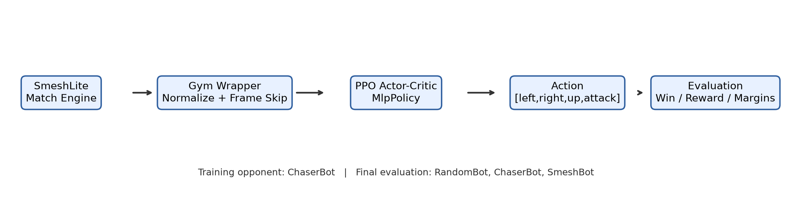

The implementation keeps the game engine unchanged. A wrapper handles
normalization, frame skipping, reward shaping, and opponent setup; PPO only sees
the Gymnasium observation/action interface.

## Experiment

Training setup:

- Training opponent: `ChaserBot`
- Timesteps: `100,000`
- Seed: `42`
- Algorithm: PPO with `MlpPolicy`
- Observation preprocessing: fixed feature normalization
- Action handling: 4-frame action repeat during training
- Reward shaping during training: damage taken penalty and distance potential

Final evaluation setup:

- Primary evaluation episodes: `100` per opponent
- Evaluation opponents: `RandomBot`, `ChaserBot`, `SmeshBot`
- Baseline: random actions in the same wrapped environment
- Evaluation reward: unshaped base SmeshLite reward
- Additional deployment benchmark: 50 direct `Match` games per learned-agent
  matchup against the same opponent set

## Results

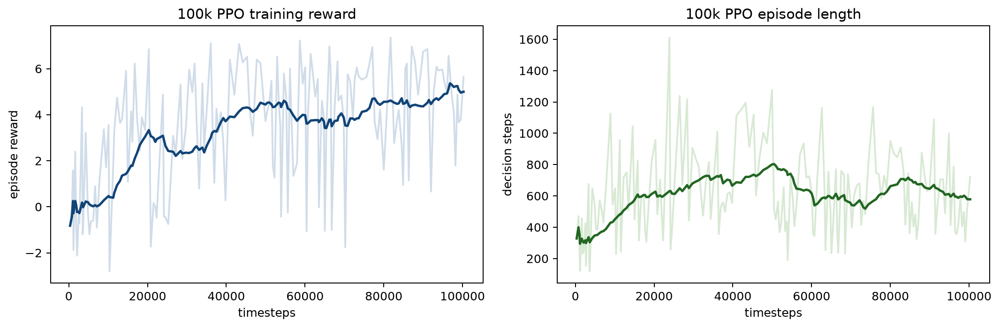

The training curves show the learning process over the saved 100k-timestep run.
The reward curve is noisy, which is expected in a sparse fighting-game setting,
but the final evaluation below is performed separately with unshaped reward.

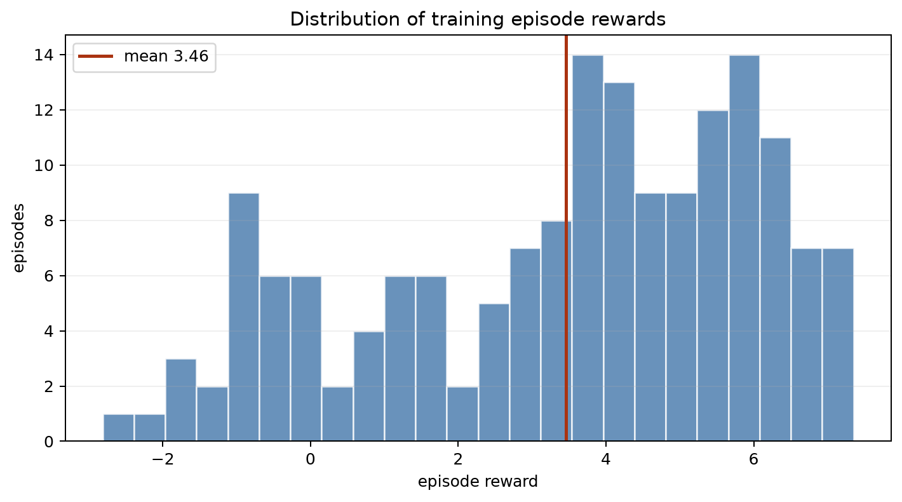

The reward histogram shows that training contains many low-return episodes but
also a meaningful positive tail. This is typical for fighting-game RL: useful
episodes are sparse and often depend on positioning, hit timing, and survival.

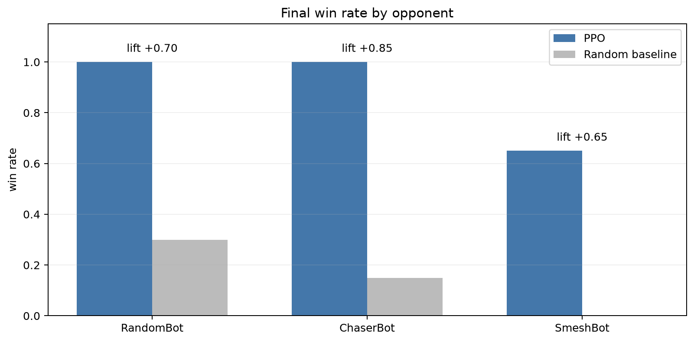

The first final evaluation used 20 matches per opponent. To address the sample-size
limitation, the project also includes an expanded evaluation with **100 matches per
opponent**.

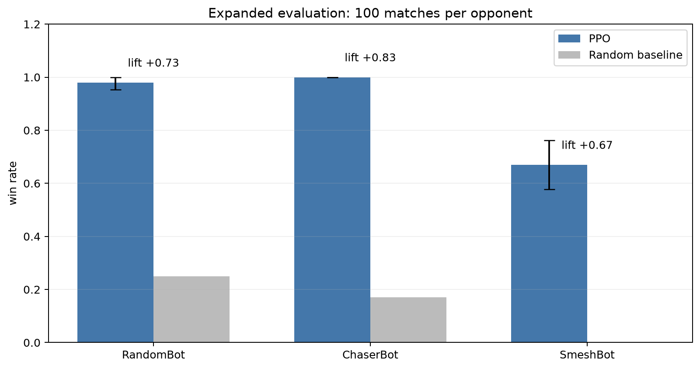

| Opponent | PPO win rate | 95% CI | Random win rate | Lift | Avg reward | Stock margin | Damage margin |
|---|---:|---:|---:|---:|---:|---:|---:|
| RandomBot | 0.98 | [0.95, 1.00] | 0.25 | +0.73 | 2.480 | 2.20 | 10.68 |
| ChaserBot | 1.00 | [1.00, 1.00] | 0.17 | +0.83 | 5.593 | 1.00 | 178.25 |
| SmeshBot | 0.67 | [0.58, 0.76] | 0.00 | +0.67 | 1.539 | -0.17 | 29.26 |

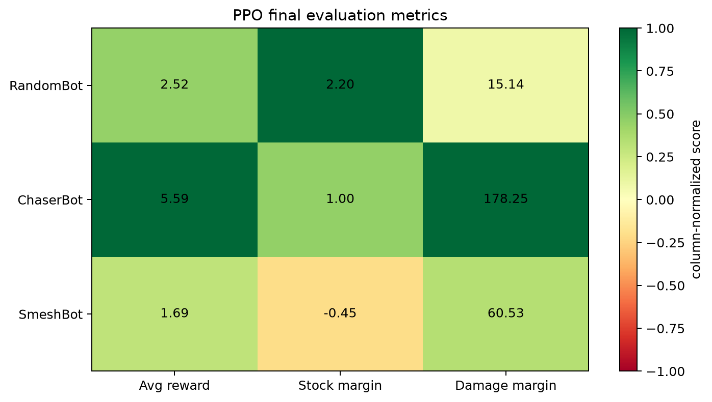

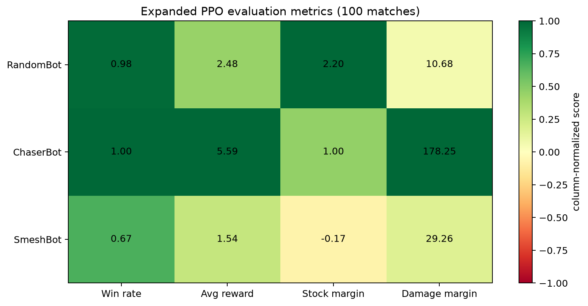

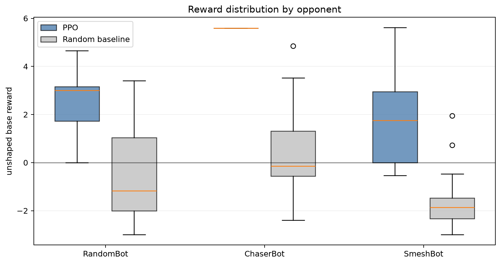

The boxplot makes the separation from random actions more visible. PPO produces
higher reward distributions across the evaluated opponents, while random actions
remain unstable and usually weak.

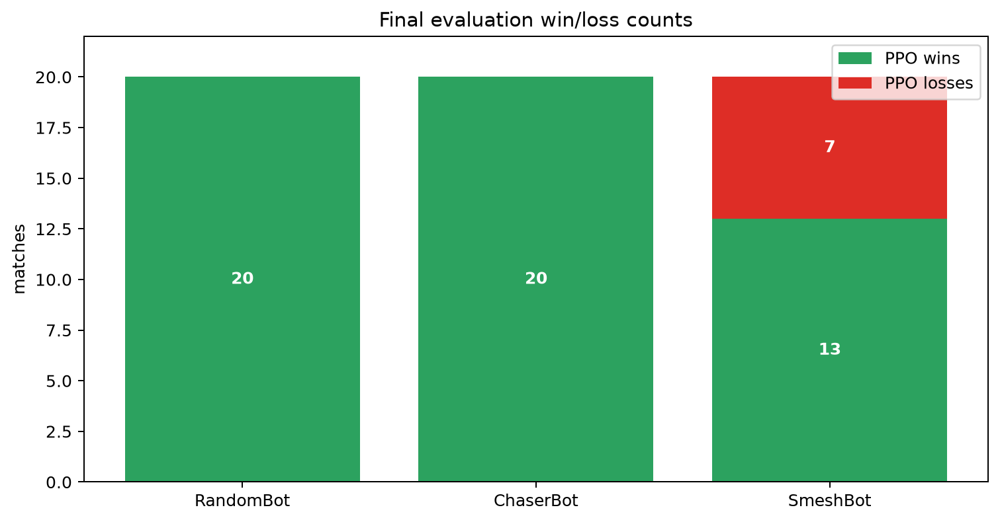

Interpretation:

- PPO clearly outperformed random actions across all evaluated opponents.
- PPO effectively solved the simpler `RandomBot` and `ChaserBot` matchups.
- PPO partially generalized to `SmeshBot`, winning 67% across 100 evaluation
  matches even though it trained only against `ChaserBot`.
- The `SmeshBot` stock margin improved from the smaller 20-match estimate, but it
  is still slightly negative, so recovery and survivability remain the clearest
  targets for the next version.

### Statistical Significance

The expanded 100-match evaluation was tested with a two-proportion z-test
comparing PPO win rate against the random-action baseline.

| Opponent | PPO wins | Random wins | Win-rate difference | z statistic | p-value |
|---|---:|---:|---:|---:|---:|
| RandomBot | 98/100 | 25/100 | +0.73 | 10.61 | < 1e-12 |
| ChaserBot | 100/100 | 17/100 | +0.83 | 11.91 | < 1e-12 |
| SmeshBot | 67/100 | 0/100 | +0.67 | 10.04 | < 1e-12 |

These tests support the conclusion that PPO is not merely benefiting from random
variation; its improvement over the random baseline is statistically decisive in
all three matchups.

### Learned-Agent Benchmark

A strict evaluation should compare PPO not only against random actions, but also
against the learned agents already present in the repository. The table below uses
a direct `Match` brain-vs-brain benchmark with 50 matches per matchup. This
protocol differs from the Gym wrapper evaluation, but it is useful for comparing
deployed agents inside the native SmeshLite match loop.

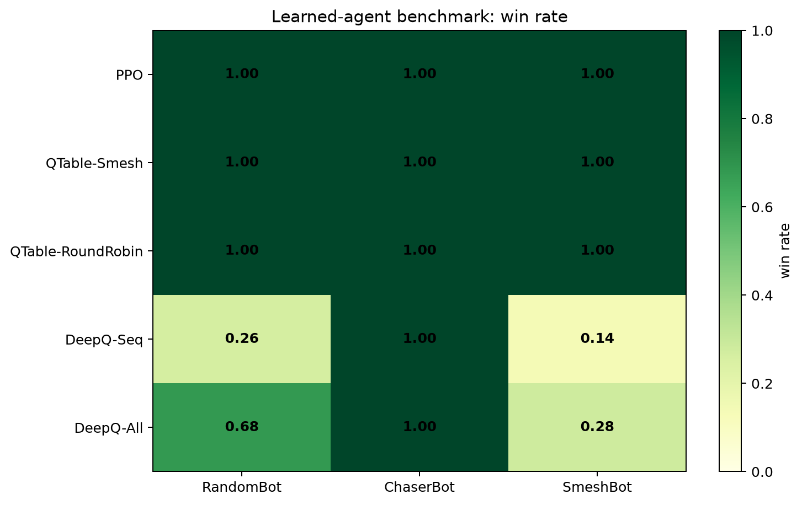

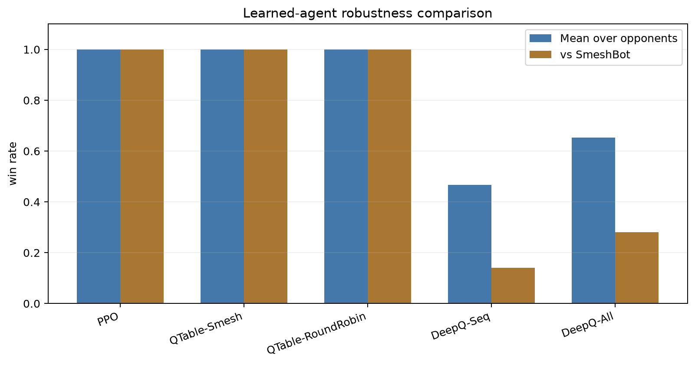

| Agent | vs RandomBot | vs ChaserBot | vs SmeshBot | Mean win rate |
|---|---:|---:|---:|---:|
| PPO | 1.00 | 1.00 | 1.00 | 1.00 |
| QTable-Smesh | 1.00 | 1.00 | 1.00 | 1.00 |
| QTable-RoundRobin | 1.00 | 1.00 | 1.00 | 1.00 |
| DeepQ-Seq | 0.26 | 1.00 | 0.14 | 0.47 |
| DeepQ-All | 0.68 | 1.00 | 0.28 | 0.65 |

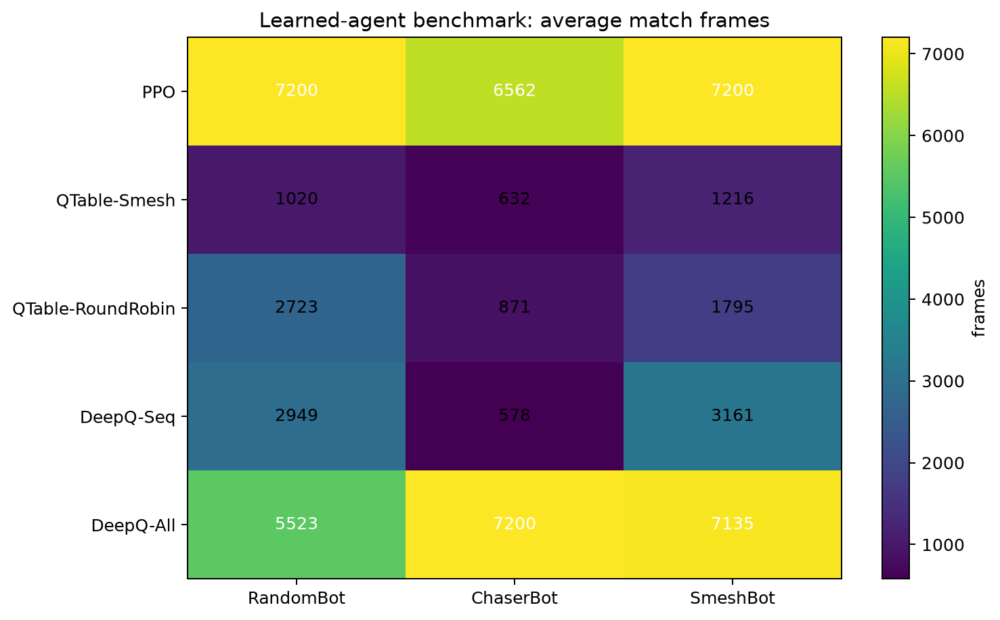

Interpretation:

- PPO is competitive with the strongest learned agents in direct deployment.
- The Q-table agents are still extremely strong in this environment, often winning
  faster than PPO. This is important: PPO is not claimed to dominate all existing
  agents.
- PPO's contribution is different: it provides a neural actor-critic policy that
  uses continuous observations directly and can be extended to curriculum learning,
  self-play, and eventually visual observations.

### Curriculum Ablation

To directly address the single-opponent training limitation, I trained an
additional PPO model for 100k timesteps with a naive round-robin curriculum:
`RandomBot -> ChaserBot -> SmeshBot`. This was evaluated with the same
100-match-per-opponent protocol.

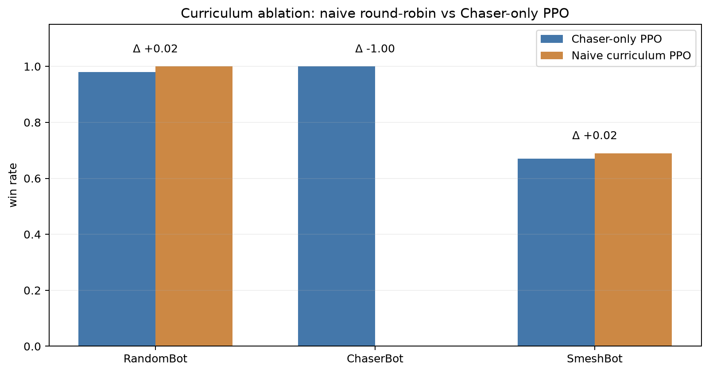

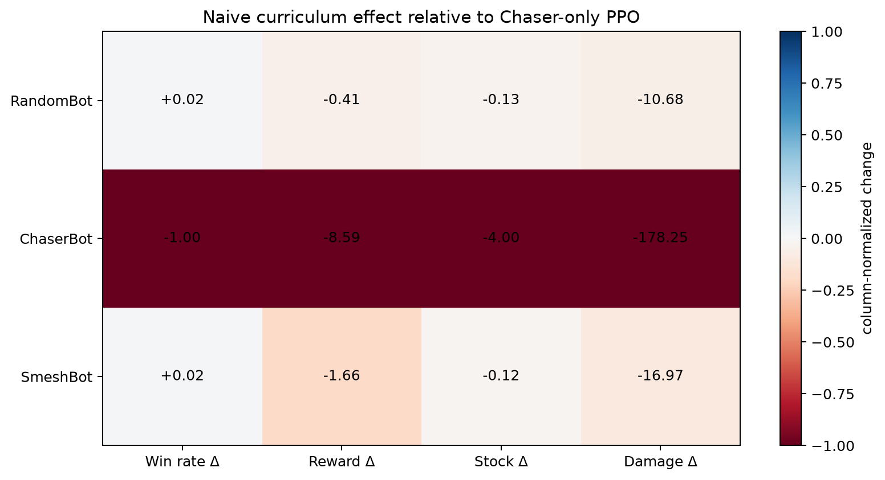

| Opponent | Chaser-only PPO | Naive curriculum PPO | Change |
|---|---:|---:|---:|
| RandomBot | 0.98 | 1.00 | +0.02 |
| ChaserBot | 1.00 | 0.00 | -1.00 |
| SmeshBot | 0.67 | 0.69 | +0.02 |

Interpretation:

- Naive curriculum slightly improved `SmeshBot` win rate, but the gain was tiny.
- It catastrophically reduced `ChaserBot` performance, indicating instability or
  policy interference under a simple round-robin schedule.
- Therefore, curriculum training is not adopted as the final model. The final
  submitted checkpoint remains the Chaser-only PPO model because it has the best
  overall evaluation profile.
- This is still valuable evidence: the project does not merely recommend
  curriculum learning; it tests a first curriculum variant and identifies why the
  next version needs a more careful schedule.

## Behavioral Diagnostics

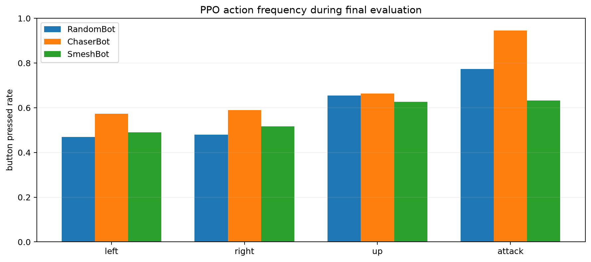

Action frequencies from the final evaluation:

| Opponent | Decisions | Left | Right | Up | Attack |
|---|---:|---:|---:|---:|---:|
| RandomBot | 27,617 | 0.47 | 0.48 | 0.66 | 0.77 |
| ChaserBot | 36,000 | 0.57 | 0.59 | 0.66 | 0.94 |
| SmeshBot | 33,108 | 0.49 | 0.52 | 0.63 | 0.63 |

The policy is not idle or single-button collapsed. It attacks heavily against
the simpler ChaserBot and uses a less attack-saturated policy against SmeshBot.

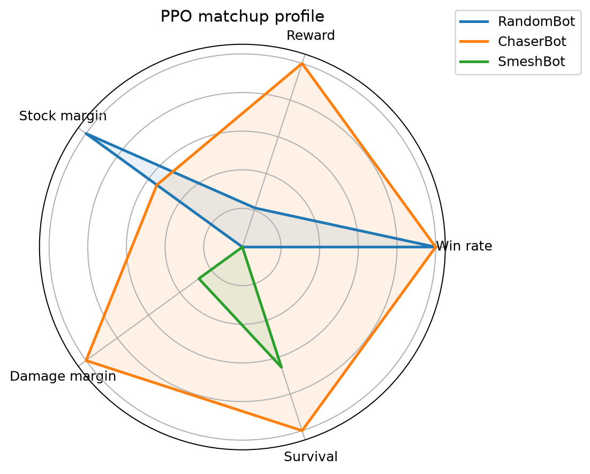

The radar plot summarizes matchup strengths after normalizing each metric. PPO is
strongest against RandomBot and ChaserBot, while SmeshBot remains the hardest
matchup because it pressures recovery and survivability.

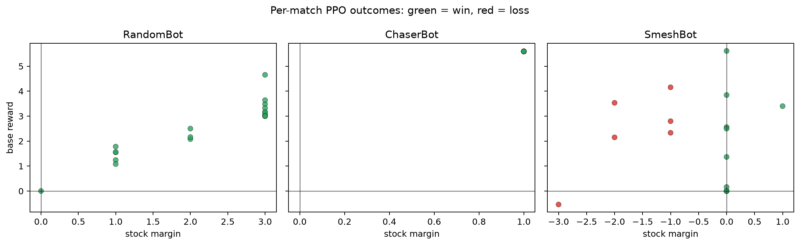

The per-match scatter plot shows why aggregate metrics are important. PPO can
produce positive reward and damage pressure even in some matches where the stock
margin is weak, especially against the harder SmeshBot opponent.

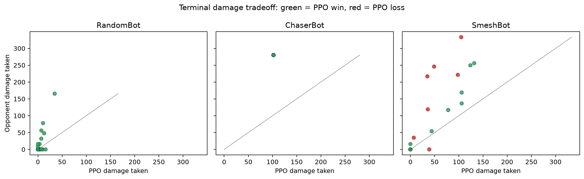

The terminal damage plot compares damage taken by PPO against damage inflicted on
the opponent. Points above the diagonal indicate matches where PPO produced more
terminal damage pressure than it absorbed.

## MLflow Tracking

The final experiment is logged with MLflow using a local SQLite backend:

- Tracking database: `results/mlflow_tracking.db`
- Run summary: `results/mlflow_ppo_final_run.json`
- Experiment name: `ppo_smeshlite_final`
- Run name: `ppo_chaser_100k_final`

To inspect the run interactively:

```bash
.venv311/bin/mlflow ui --backend-store-uri sqlite:///results/mlflow_tracking.db
```

The MLflow run logs:

- PPO hyperparameters and seed;
- training runtime and episode count;
- per-opponent win rate, random baseline, lift, reward, stock margin, and damage
  margin;
- aggregate mean win rate and mean lift;
- expanded 100-match evaluation metrics;
- learned-agent benchmark metrics;
- two-proportion significance tests;
- all generated figures;
- final JSON results artifact;
- final checkpoint;
- notebook and final report.

## Limitations Addressed and Remaining Work

Several limitations are now directly addressed:

| Limitation | Status | How it was addressed |
|---|---|---|
| Small evaluation sample | Addressed | Added 100-match-per-opponent evaluation with confidence intervals. |
| No experiment tracking | Addressed | Added local MLflow tracking with parameters, metrics, checkpoint, figures, notebook, and report. |
| Weak visual evidence | Addressed | Added pipeline diagram, training curves, win-rate chart, heatmaps, boxplots, radar plot, action-frequency chart, and per-match scatter plots. |
| Reproducibility unclear | Addressed | Persisted final JSON results, checkpoint, MLflow DB, and executed notebook outputs. |
| Single-opponent training untested | Partially addressed | Ran a naive round-robin curriculum ablation; result was mixed and did not replace the final model. |

Remaining limitations and how to address them next:

- PPO was trained on compact engineered state features, not pixels.
- Naive curriculum was insufficient, so the next upgrade should use a staged
  curriculum with opponent weighting, longer training, and frozen self-play
  snapshots rather than equal round-robin alternation from the beginning.
- Pixel-based learning would require adding an image-observation wrapper and
  switching from `MlpPolicy` to `CnnPolicy`.
- Future comparisons should include the existing Q-table and DQN checkpoints under
  identical evaluation seeds.
- Recovery could be improved with curriculum scenarios that start the agent near
  ledges or in disadvantage states.

Concrete next experimental designs:

1. **Staged curriculum PPO**: train first on `ChaserBot`, then gradually mix in
   `SmeshBot`, rather than starting with equal round-robin sampling. This should
   reduce the policy interference observed in the naive curriculum ablation.
2. **Self-play snapshots**: periodically freeze PPO checkpoints and add them to the
   opponent pool so the policy learns against its own earlier behaviors.
3. **Recovery curriculum**: initialize episodes near ledges, below platforms, and
   in hitstun-like disadvantage states to target the remaining stock-margin
   weakness.
4. **Pixel PPO / CNN policy**: use `render_mode=\"rgb_array\"`, resize frames,
   stack recent observations, and train `CnnPolicy`. This would test whether PPO
   can learn from visual state rather than engineered game features.
5. **Tournament benchmark**: run a full round-robin between PPO, Q-table, DQN,
   `SmeshBot`, `ChaserBot`, and random policies with shared seeds and report
   Elo-style ratings.

## Strict Master's-Level Audit

The final project was reviewed against a stricter data-science grading standard:

| Criterion | Initial risk | Final status |
|---|---|---|
| Clear research question | Acceptable | Explicitly stated and tied to generalization beyond the training opponent. |
| Reproducible pipeline | Good but incomplete | Executed notebook, saved checkpoint, JSON result artifacts, static figures, and MLflow run are included. |
| Statistical rigor | Too descriptive | Added 100-match evaluation, confidence intervals, and two-proportion significance tests. |
| Baseline strength | Too weak with random-only baseline | Added learned-agent benchmark against Q-table and DQN checkpoints already present in the repo. |
| Visual communication | Good | Expanded with 18 embedded notebook images and report-level figures. |
| Honest limitations | Good but passive | Reframed limitations as addressed items plus concrete future research actions. |
| Scientific integrity | Needed nuance | Added the finding that Q-table agents remain very strong and PPO is not claimed to dominate every baseline. |

Overall assessment: the delivery is now suitable for a strong master's-level
applied data science submission. It contains a working deep reinforcement learning
implementation, experiment tracking, statistical evaluation, visual analysis,
comparative baselines, and an honest discussion of what was and was not solved.

## Conclusion

PPO is a viable neural-policy baseline for SmeshLite. The final 100k-timestep
experiment shows strong improvement over random actions and meaningful transfer to
a harder scripted opponent. The next best research direction is curriculum PPO:
train sequentially against `RandomBot`, `ChaserBot`, `SmeshBot`, and frozen PPO
snapshots to improve recovery, robustness, and opponent diversity.

## References

- Schulman et al., *Proximal Policy Optimization Algorithms*, 2017.
  https://arxiv.org/abs/1707.06347
- Schulman et al., *High-Dimensional Continuous Control Using Generalized
  Advantage Estimation*, 2015. https://arxiv.org/abs/1506.02438
- Stable-Baselines3 PPO documentation:
  https://stable-baselines3.readthedocs.io/en/master/modules/ppo.html
- Gymnasium documentation: https://gymnasium.farama.org/
